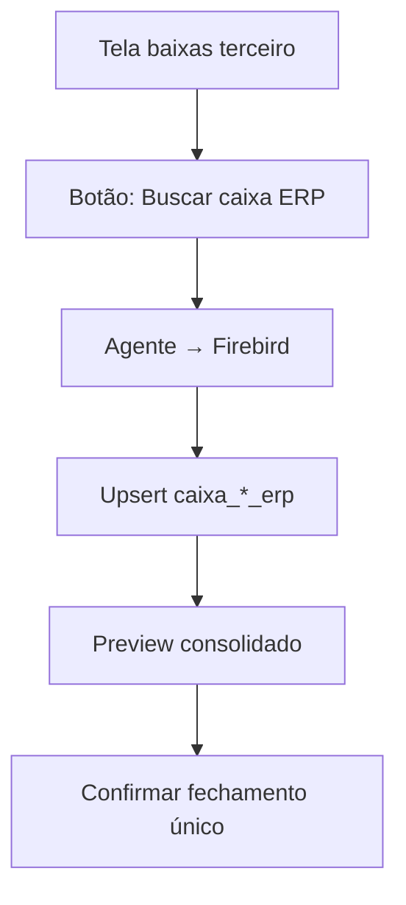

# Integração NEST_ANGULAR — Caixa ERP (Firebird → PostgreSQL)

Documento de handoff do projeto **AVALIACAO_BANCO_FIREBIRD** para implementação no **NEST_ANGULAR**.

**Status da validação:** confirmado (out/2025, filial 2 Inhumas)  
**Referência oficial:** Movimentação de Caixa OUT/2025 (PDF/TXT)  
**Última atualização:** jul/2026 — fluxo manual com **upsert** (sem trava FC31000)

---

## 1. Objetivo

Importar do Firebird local as **baixas de caixa da unidade** (requisições produzidas + produtos comercializados na loja) para:

- Fechamento de caixa local (somando com vendas de terceiro já existentes)
- Comissão de vendedores (base = valor **recebido**, não orçamento)
- Orçamentos aprovados ainda não baixados
- Metas (fase posterior)
- Produção (fase posterior)

---

## 2. Dois fluxos — não misturar

| Fluxo | Onde vive hoje | Origem | Fechamento |
|-------|----------------|--------|------------|
| **Vendas de terceiro** | PG: `vendas` + `baixas` | Cadastro manual no NEST_ANGULAR | Fechamento interunidades (continua igual) |
| **Caixa local ERP** | **A criar** | Firebird via agente | Fechamento caixa da filial |

**Regra:** não reutilizar a tabela `baixas` (terceiro) para import ERP. Origem, chaves e regras são diferentes.

---

## 3. O que o agente já faz vs o que falta

### Já sincronizado (agente → PostgreSQL)

| Entidade PG | Firebird | Uso |
|-------------|----------|-----|
| `orcamentos` | FC15100 (+ FC15000) | Pipeline orçamento |
| `clientes` | FC07000 | Cadastro |
| `prescritores` | FC04000 | Cadastro |
| `vendedores` | FC08000 / FC17200 | Ligado por `cdVendedor` = CDFUN |

### Caixa ERP (implementado no agente)

| Endpoint | SQL | Uso |
|----------|-----|-----|
| `POST /api/v1/caixa/pagamentos` | core | Pagamentos FC31600 |
| `POST /api/v1/caixa/itens` | itens | Linhas analíticas |
| `POST /api/v1/caixa/requisicoes-pagas` | complemento | Comissão / req paga |
| `POST /api/v1/caixa/fechamento-dia` | resumo | Totais por forma |

O endpoint legado `POST /api/v1/vendas/total-dia` foi **removido** (POC não consumido).

---

## 4. SQLs validados (copiar para o agente)

Origem no repositório de avaliação:

```
AVALIACAO_BANCO_FIREBIRD/sql/validacao/
├── caixa_baixas_outubro_core.sql         ← pagamentos (FC31600)
├── caixa_baixas_outubro_itens.sql        ← linhas analíticas (FC31110)
├── caixa_baixas_outubro_complemento.sql  ← requisições pagas (FC17000)
├── caixa_baixas_outubro_detalhe.sql      ← pagamento + contexto cupom
├── caixa_baixas_outubro_resumo.sql       ← totais rodapé PDF
└── caixa_baixas_outubro.sql              ← índice (não executar)
```

Parametrizar no agente: `:cdfil`, `:data_inicio`, `:data_fim` (hoje fixo filial 2 / out/2025).

### Performance de referência (out/2025, ~830 pagamentos)

| SQL | Linhas | Tempo |
|-----|--------|-------|
| core | 830 | ~30 ms |
| itens | 876 | ~30 ms |
| detalhe | 830 | ~50 ms |
| complemento | 754 | ~300 ms |
| resumo | 4 | instantâneo |

### Totais confirmados vs PDF (filial 2, out/2025)

| Forma | Qtd | Valor líquido |
|-------|-----|---------------|
| Dinheiro (+ 1 convênio) | 117 | R$ 19.896,81 |
| Cartão Pré | 713 | R$ 191.389,61 |
| **Total** | | **R$ 211.286,42** |
| Troco | | R$ 131,80 |

---

## 5. Camadas de SQL e uso no sistema

| Camada | Arquivo | 1 linha = | Alimenta PG | Uso |
|--------|---------|-----------|-------------|-----|
| **Resumo** | `resumo.sql` | forma × período | view / query | Dashboard fechamento dia |
| **Core** | `core.sql` | pagamento FC31600 | `caixa_pagamentos_erp` | Fechamento caixa, forma, troco |
| **Itens** | `itens.sql` | item FC31110 | `caixa_itens_erp` | PDF analítico, split cupom |
| **Complemento** | `complemento.sql` | requisição FC17000 | `caixa_requisicoes_pagas` | Comissão, desconto, orçamento baixado |
| **Detalhe** | `detalhe.sql` | pagamento + contexto | opcional | Import enriquecido (sem orçamento) |

### Mapeamento FMPAG → forma_pagamento

| FMPAG | INDRECCONV | forma_pagamento |
|-------|------------|-----------------|
| 1 | N | DINHEIRO |
| 1 | S | CONVENIO-DINHEIRO |
| 4 | — | DEPOSITO |
| 6 | N | CARTAO PRE |

### Regra do valor líquido

```sql
valor_liquido = vrpag - COALESCE(vrtrc, 0)
```

Aplicar em dinheiro e convênio-dinheiro. Cartão e depósito: troco = 0.

---

## 6. Tabelas Firebird envolvidas

| Tabela | Papel |
|--------|-------|
| **FC31600** | Pagamento / baixa (fonte oficial do caixa) |
| **FC31100** | Capa cupom (VRTOT, VRLIQ, CDFUNRE operador) |
| **FC31110** | Itens do cupom |
| **FC31200** | Vínculo item ↔ requisição (NRRQU) |
| **FC17000** | Requisição paga (VRRQU, VRDSC, VRLIQ) |
| **FC17200** | Vendedor da requisição (TPTAR = 'R') |
| **FC12100** | NRRQU ↔ NRORC |
| **FC15100** | Orçamento (preço por fórmula) |
| **FC08000** | Nome vendedor / operador |
| **FC07000** | Cliente (opcional) |

### FC31000 — não usar como gate de sync

| Item | Conclusão |
|------|-----------|
| Papel | Log de eventos do terminal de caixa (abertura por estação) |
| `NRCPM` | Sempre NULL — não liga a cupom/pagamento |
| Uso na integração | **Não bloquear** busca por existência/ausência de registro |
| Motivo | Eventos são majoritariamente abertura; fechamento não é confiável como sinal único |

A abertura do caixa no ERP pode **travar edição do dia anterior** no sistema legado, mas a integração **não depende** de consultar FC31000 — o operador dispara a busca manualmente quando for fechar.

### Não usar para totais de caixa

| Tabela | Motivo |
|--------|--------|
| FC17100 / FC17110 | Fluxo farmácia; totais maiores que relatório caixa |
| FC31500 | Sangria / depósito |
| FC31000 | Só auditoria operacional; **não** gate de import |
| `movimentos_outubro.sql` | Legado; duplica linhas por item |

---

## 7. Fluxo de negócio (orçamento → baixa)

```
FC15100 (orçamento)
    ↓ FC12100 (NRRQU ↔ NRORC)
FC17000 (requisição: VRRQU, VRDSC, VRLIQ)
    ↓ FC31110 + FC31200 (item cupom)
FC31100 (capa) + FC31600 (pagamento por forma)
```

---

## 8. Tabelas PostgreSQL propostas

### 8.1 Novas (caixa ERP) — 3 tabelas + 1 agregada

#### `caixa_pagamentos_erp` ← `core.sql`

| Coluna PG | Tipo | Origem Firebird |
|-----------|------|-----------------|
| id | uuid | gerado |
| unidade | enum/varchar | CDFIL |
| data | date | DTOPE |
| cupom | integer | NRCPM |
| cdtml | integer | CDTML |
| operid | integer | OPERID |
| forma_pagamento | varchar | FMPAG + INDRECCONV |
| valor_bruto | numeric(15,2) | VRPAG |
| troco | numeric(15,2) | VRTRC |
| valor_liquido | numeric(15,2) | VRPAG - VRTRC |
| total_cupom_bruto | numeric(15,2) | FC31100.VRTOT |
| total_cupom_liquido | numeric(15,2) | FC31100.VRLIQ |
| cdcli | integer | FC31100.CDCLI |
| codigo_operador | integer | FC31100.CDFUNRE |
| operador_caixa | varchar | FC08000.NOMEFUN |
| chave_erp | varchar unique | `{cdfil}-{cdtml}-{dtope}-{operid}-{nrcpm}-{fmpag}` |
| importado_em | timestamptz | última busca no agente |
| atualizado_em | timestamptz | último upsert |

**Upsert:** mesma `chave_erp` → **atualiza** valores (valor, troco, operador, etc.). Não travar reimport do dia — cada clique no botão **refresca** os dados ERP da data selecionada.

#### `caixa_itens_erp` ← `itens.sql`

| Coluna PG | Tipo | Origem |
|-----------|------|--------|
| id | uuid | gerado |
| pagamento_id | uuid FK | caixa_pagamentos_erp |
| unidade | | CDFIL |
| data | date | DTOPE |
| cupom | integer | NRCPM |
| item_cupom | integer | FC31110.ITEMID |
| tipo_item | enum | REQUISICAO \| PRODUTO |
| codigo_item | integer | NRRQU ou CDPRO |
| requisicao | integer nullable | FC31200.NRRQU |
| descricao_item | varchar nullable | FC03000.DESCR/DESCRPRD (tipo PRODUTO) |
| quant | numeric | FC31110.QUANT |
| valor_item_bruto | numeric | FC31110.VRTOT |
| valor_item_liquido | numeric | FC31110.VRLIQ |
| desconto_item | numeric | FC31110.VRDSC |
| chave_erp | varchar unique | `{cdfil}-{cdtml}-{dtope}-{operid}-{nrcpm}-{itemid}` |
| importado_em / atualizado_em | timestamptz | upsert igual pagamentos |

#### `caixa_requisicoes_pagas` ← `complemento.sql`

| Coluna PG | Tipo | Origem |
|-----------|------|--------|
| id | uuid | gerado |
| unidade | | CDFIL |
| data_pagamento | date | FC17000.DTEFE |
| requisicao | integer | FC17000.NRRQU |
| cupom | integer | FC17000.NRCPM |
| nr_orcamento | integer | FC12100.NRORC |
| qtd_formulas | integer | COUNT FC15100 |
| valor_orcamento | numeric | SUM(PRCOBR - VRDSC) FC15100 |
| valor_requisicao_bruto | numeric | FC17000.VRRQU |
| desconto_requisicao | numeric | FC17000.VRDSC |
| valor_pago_requisicao | numeric | FC17000.VRLIQ |
| gap_orcamento_vs_pago | numeric | valor_orcamento - valor_pago |
| codigo_vendedor | integer | FC17200.CDFUN |
| vendedor | varchar | FC08000.NOMEFUN |
| orcamento_id | uuid FK nullable | orcamentos.id (match nrorc+unidade) |
| chave_erp | varchar unique | `{cdfil}-{nrrqu}-{nrcpm}-{dtefe}` |
| importado_em / atualizado_em | timestamptz | upsert |

#### `caixa_fechamento_consolidado` (tabela ou snapshot por ação do usuário)

Registro do fechamento **confirmado** na tela (ERP + terceiro). Separado dos dados ERP importados:

| Coluna | Uso |
|--------|-----|
| unidade, data | Dia fechado |
| totais_terceiro | JSON ou colunas por forma |
| totais_erp | Recalculado na hora do import |
| totais_consolidados | Soma |
| confirmado_em, confirmado_por | Auditoria |
| status | `RASCUNHO` \| `CONFIRMADO` |

**Import ERP** pode rodar várias vezes (upsert). **Confirmar fechamento** é ação distinta — trava só o snapshot consolidado, não impede nova busca ERP para conferência.

#### `caixa_fechamento_dia` (view — recalculada a cada import)

Agregação sobre `caixa_pagamentos_erp`:

```sql
SELECT unidade, data, forma_pagamento,
       COUNT(*) AS qtd_baixas,
       SUM(valor_bruto) AS total_bruto,
       SUM(troco) AS total_troco,
       SUM(valor_liquido) AS total_liquido
FROM caixa_pagamentos_erp
GROUP BY unidade, data, forma_pagamento
```

Equivalente a `caixa_baixas_outubro_resumo.sql`.

### 8.2 Existentes — manter

| Tabela | Papel |
|--------|-------|
| `vendas` | Vendas de terceiro |
| `baixas` | Baixas manuais terceiro |
| `orcamentos` | Sync FC15100 — atualizar status BAIXADO |
| `vendedores` | Match por `cdVendedor` |
| `clientes`, `prescritores` | Cadastros |

**Total envolvido no ciclo:** ~8 tabelas PG (3 sync + 2 terceiro + 3 caixa ERP).

---

## 9. Fluxo operacional — botão na tela (sem FC31000)

Disparo **manual** pelo operador, na tela de **baixas / fechamento de vendas de terceiro**.



### Regras

| Regra | Detalhe |
|-------|---------|
| **Sem gate FC31000** | Não verificar abertura/fechamento de terminal antes de buscar |
| **Upsert, não insert-only** | Rebuscar o mesmo dia **atualiza** registros existentes por `chave_erp` |
| **Sem filtro FLAGBXA** | Importação **não** filtra `FC31100.FLAGBXA = 'S'`; traz todos os cupons do período |
| **Data livre** | Operador escolhe o dia (tipicamente D-1 ou dia em fechamento) |
| **Fechamento confirmado** | Snapshot consolidado (terceiro + ERP) — independente de poder reimportar ERP |

### Request sugerido (backend)

```json
POST /api/fechamento/importar-caixa-erp
{
  "unidade": 2,
  "data": "2025-10-01"
}
```

### Response (preview antes de confirmar)

```json
{
  "data": "2025-10-01",
  "erp": {
    "pagamentosImportados": 830,
    "pagamentosAtualizados": 12,
    "totaisPorForma": {
      "DINHEIRO": { "qtd": 116, "liquido": 18379.07 },
      "CONVENIO-DINHEIRO": { "qtd": 1, "liquido": 1517.74 },
      "CARTAO PRE": { "qtd": 713, "liquido": 191389.61 }
    }
  },
  "terceiro": { "totaisPorForma": { } },
  "consolidado": { "totalLiquido": 0 }
}
```

---

## 10. Endpoints sugeridos no agente

| Método | Rota | SQL base | Body |
|--------|------|----------|------|
| POST | `/api/v1/caixa/pagamentos` | core | `{ date, unit }` ou `{ start, end, unit }` |
| POST | `/api/v1/caixa/itens` | itens | idem |
| POST | `/api/v1/caixa/requisicoes-pagas` | complemento | idem |
| POST | `/api/v1/caixa/fechamento-dia` | resumo | `{ date, unit }` |

Backend chama o agente **somente quando o operador clica no botão** (não job automático).

### Ordem no import (upsert)

1. Pagamentos (`core`) — `ON CONFLICT (chave_erp) DO UPDATE`
2. Itens (`itens`) — upsert; realign FK pagamento_id
3. Requisições pagas (`complemento`) — upsert
4. Recalcular view `caixa_fechamento_dia`
5. Atualizar `orcamentos.status` → **BAIXADO** quando `nrorc` existir em `caixa_requisicoes_pagas`

Registros que **sumiram** no Firebird após rebusca: tratar com política explícita (soft-delete `ativo=false` ou manter histórico) — definir na implementação.

---

## 11. Consultas de negócio

### Total por dia por forma de pagamento

Fonte: `caixa_fechamento_dia` ou `resumo.sql` / agregação sobre `core`.

### Total recebido por vendedor (comissão)

**Usar `caixa_requisicoes_pagas`**, não somar `detalhe` por vendedor.

```sql
SELECT codigo_vendedor, vendedor,
       COUNT(*) AS qtd_requisicoes,
       SUM(valor_pago_requisicao) AS total_recebido
FROM caixa_requisicoes_pagas
WHERE unidade = :unidade AND data_pagamento BETWEEN :inicio AND :fim
GROUP BY codigo_vendedor, vendedor
```

**Produtos de loja** (sem requisição): agregar `caixa_itens_erp` WHERE `tipo_item = 'PRODUTO'`. Vendedor = operador do caixa (`codigo_operador` em `caixa_pagamentos_erp`) — validar regra com gestão.

### Orçamentos aprovados não baixados

```sql
SELECT o.*
FROM orcamentos o
LEFT JOIN caixa_requisicoes_pagas r
  ON r.nr_orcamento = o.nrorc AND r.unidade = o.unidade
WHERE o.status = 'APROVADO'
  AND r.id IS NULL
```

### Fechamento consolidado (caixa local + terceiro)

```sql
-- Caixa ERP (Firebird)
SELECT 'ERP' AS origem, data, forma_pagamento, SUM(valor_liquido)
FROM caixa_pagamentos_erp GROUP BY ...

UNION ALL

-- Terceiro (NEST_ANGULAR)
SELECT 'TERCEIRO', data_baixa, tipo_da_baixa, SUM(valor_baixa)
FROM baixas b JOIN vendas v ON ... GROUP BY ...
```

---

## 12. Caso crítico — cupom multi-requisição (86721)

| Campo | Valor |
|-------|-------|
| Cupom | 70523 (01/10/2025) |
| Requisição 86721 | R$ 350,00 pago |
| Requisição 86735 | R$ 260,00 pago |
| Pagamento cartão | R$ 610,00 |

**Erro a evitar:** comparar orçamento de uma requisição (R$ 454,16) com total do cupom (R$ 610) → desconto negativo falso.

**Correto:**

- `core`: 1 linha, pagamento R$ 610
- `itens`: 2 linhas (350 + 260)
- `complemento`: 2 linhas, desconto por NRRQU via FC17000

---

## 13. Campos exportados (referência CSV)

Gerados por `scripts/validate/export_caixa_baixas.py --fonte {core|itens|complemento|detalhe}`.

### core

`filial, data, cupom, forma_pagamento, valor_bruto, troco, valor_liquido, total_cupom_bruto, total_cupom_liquido, cdcli, codigo_operador, operador_caixa`

### itens

`filial, data, cupom, item_cupom, tipo_item, codigo_item, requisicao, quant, valor_item_bruto, valor_item_liquido, desconto_item, pagamento_cupom`

### complemento

`filial, data_pagamento, requisicao, cupom, nr_orcamento, qtd_formulas, valor_orcamento, valor_requisicao_bruto, desconto_requisicao, valor_pago_requisicao, diferenca_calculo, gap_orcamento_vs_pago, codigo_vendedor, vendedor`

### detalhe

`filial, data, cupom, forma_pagamento, tipo_baixa, qtd_requisicoes, requisicao_principal, valor_bruto, troco, valor_liquido, vendedor, codigo_vendedor, operador_caixa, cdcli, nomecli, total_cupom_bruto, total_cupom_liquido`

---

## 14. Checklist de implementação no NEST_ANGULAR

### Fase 1 — Caixa e fechamento único

- [ ] Copiar SQLs validados para `agent/src/database/queries/caixa/`
- [ ] Parametrizar `:cdfil`, `:start`, `:end` nos SQLs
- [ ] Criar migrations: `caixa_pagamentos_erp`, `caixa_itens_erp`, `caixa_requisicoes_pagas`, `caixa_fechamento_consolidado`
- [ ] Upsert por `chave_erp` (permitir rebusca do mesmo dia)
- [ ] **Não** usar FC31000 como condição de import
- [ ] Botão na tela de baixas terceiro → `POST /fechamento/importar-caixa-erp`
- [ ] Preview ERP + terceiro + consolidado antes de confirmar
- [ ] View `caixa_fechamento_dia`

### Fase 2 — Comissão e pipeline orçamento

- [ ] Relatório vendedor via `caixa_requisicoes_pagas`
- [ ] Regra produtos loja (`caixa_itens_erp` tipo PRODUTO)
- [ ] Status orçamento BAIXADO (link `nrorc`)
- [ ] Dashboard orçamentos aprovados não baixados

### Fase 3 — Metas e produção

- [ ] Metas sobre valor pago (complemento)
- [ ] Import etapas produção (domínio separado)

---

## 15. Arquivos para copiar entre projetos

```
AVALIACAO_BANCO_FIREBIRD/
├── sql/validacao/caixa_baixas_outubro_*.sql   → agent/queries/
├── catalogo/integracao-nest-angular-caixa.md  → docs/ (este arquivo)
├── catalogo/caixa-pagamentos.md               → referência técnica
└── scripts/validate/export_caixa_baixas.py    → referência de colunas
```

---

## 16. Contato / continuidade

Detalhes técnicos adicionais: `catalogo/caixa-pagamentos.md` e `catalogo/RESUMO.md` no repositório AVALIACAO_BANCO_FIREBIRD.

Validação numérica reproduzível:

```powershell
cd AVALIACAO_BANCO_FIREBIRD
python scripts/validate/export_caixa_baixas.py --fonte core
python scripts/validate/compare_caixa_pdf.py
# Esperado: VALIDACAO OK
```
